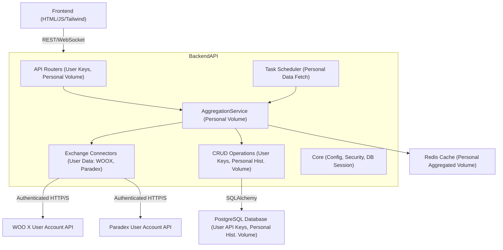

# System Patterns: Personal Aggregated Perpetual Volume Dashboard

## System Architecture
- **Frontend:** Single Page Application (SPA) built with HTML, Tailwind CSS (via CDN), and Vanilla JavaScript. Interacts with the backend via REST APIs and WebSockets to display **the user's personal aggregated volume**.
- **Backend:** FastAPI (Python) application serving as an API gateway and data processing engine for **the user's trading data**.
    - **API Layer:** Exposes REST endpoints for API key management (essential for accessing user account data), retrieval of **historical personal volume**, **current personal volume**. Provides a WebSocket endpoint for real-time **personal volume** updates.
    - **Service Layer:**
        - `AggregationService`: Orchestrates data fetching from the user's accounts on multiple exchanges and aggregates **their personal volume data**.
        - `Exchange Connectors`: Individual modules for each supported exchange (Bybit, WOO X, Hyperliquid, Paradex) responsible for API interaction with **user-specific authenticated endpoints** (e.g., trade history, account volume summaries) and data transformation.
    - **Data Access Layer (CRUD):** Handles database interactions for storing and retrieving API keys and **historical personal volume data**.
    - **Core Components:** Configuration management, security (encryption for API keys), database session management.
- **Database:** PostgreSQL for persistent storage of:
    - User-provided API keys (encrypted).
    - Fetched **historical daily personal trading volume data** (derived from user's trade history or account summaries).
- **Cache:** Redis for caching frequently accessed data (e.g., latest **aggregated personal volume**).
- **Task Scheduling:** A scheduler (e.g., APScheduler) for periodic fetching of **historical and current personal volume data**.
- **Deployment:** Containerized using Docker, with `docker-compose` for local development.

## Key Technical Decisions
- **Backend Framework:** FastAPI.
- **Database:** PostgreSQL with SQLAlchemy.
- **Caching:** Redis.
- **API Key Security:** Symmetric encryption (Fernet).
- **Frontend:** Vanilla JavaScript with Tailwind CSS.
- **Asynchronous Operations:** `async/await` in Python, `httpx`.
- **Containerization:** Docker.
- **Data Focus:** The system is now focused on fetching, processing, and displaying **the user's own trading volume**, not general market data. This means all connector interactions will be authenticated and target user-specific endpoints.

## Design Patterns in Use
- (Largely the same, but the data context changes)
- **Client-Server**
- **API Gateway (Conceptual)**
- **Service Layer**
- **Repository/CRUD Layer**
- **Strategy Pattern (Conceptual for Connectors)**
- **Scheduler/Background Tasks**
- **Observer Pattern (Conceptual via WebSockets for personal volume)**

## Component Relationships

## Critical Implementation Paths
- **Secure API Key Handling:** Essential as keys grant access to personal account data.
- **Reliable Exchange Connectors for User Data:** Robust implementation for fetching **user trade history or account volume summaries**. This includes handling diverse API responses, authentication methods (especially JWT for Paradex), rate limits, and pagination for potentially large trade histories.
- **Accurate Personal Data Aggregation:** Correctly fetching, processing (e.g., summing trade sizes, handling different quote currencies), and aggregating **personal volume data** from all the user's connected accounts. Normalization to USD is critical.
- **Efficient Historical Personal Data Management:** Fetching, deriving daily summaries (if necessary from raw trades), storing, and querying 1-2 years of **daily personal historical volume**.
- **Real-time Personal Volume Updates:** Effective WebSocket implementation for low-latency updates of the user's current aggregated volume.
- **API Endpoint Research (User Data):** Identifying the correct, private endpoints on each exchange for accessing user trade history or summarized account volume. This is especially critical for Paradex.
